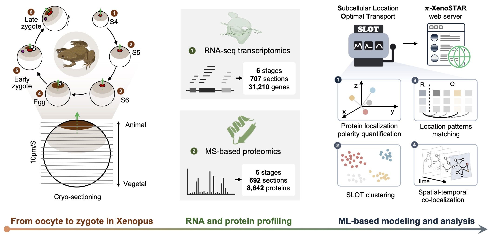

# Subcellular Location Optimal Transport (SLOT)
SLOT is an optimal-transport–based machine learning framework for quantifying and modeling the spatial–temporal localization of intracellular molecules.

## Introduction
By integrating subcellular-resolution spatial transcriptomics (mRNA) and proteomics (protein) datasets, SLOT systematically aligns and compares molecular distributions across cellular compartments and temporal stages. The framework infers relocation trajectories and quantifies dynamic shifts in subcellular localization patterns. As a comprehensive computational toolbox, SLOT enables systematic modeling of subcellular molecular spatial polarity, supporting pattern detection, spatial-location clustering investigations and spatiotemporal dynamic analysis. 



## Features

- Spatial localization polarity quantification
- Location patterns matching
- Subcellular location clustering
- Spatial-temporal co-localization detection

## Installation
### Prerequisites

- Python 3.10 or higher
- pip (Python package installer)
- scipy

### Steps

1. Clone the repository:
    ```bash
    cd ~
    git clone https://github.com/Lifeomics/SLOT.git
    cd SLOT
    ```

2. Create a conda environment and activate it:
    ```bash
    conda create --name SLOT_env python=3.10
    conda activate SLOT_env
    ```
3. Install the required packages and SLOT: 

    ```bash
    pip install -e . 
    ```
## [Tutorial](/tutorial)

