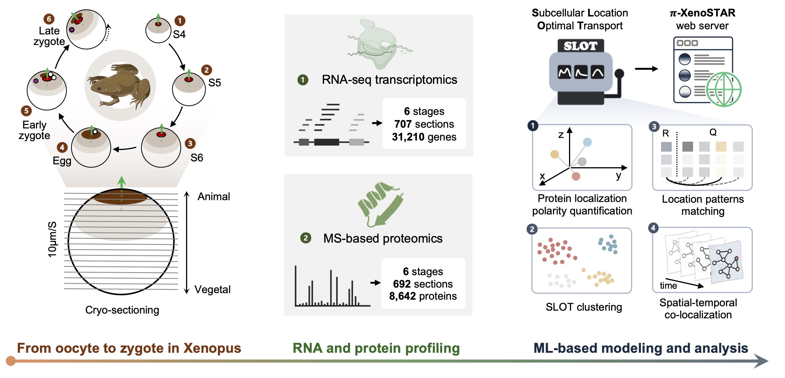

# Subcellular Location Optimal Transport (SLOT)

[](https://pypi.org/project/slot-toolkit/)
[](https://pypi.org/project/slot-toolkit/)
[](https://opensource.org/licenses/MIT)

SLOT is an optimal-transport–based machine learning framework for quantifying and modeling the spatial–temporal localization of intracellular molecules.

## Introduction
By integrating subcellular-resolution spatial transcriptomics (mRNA) and proteomics (protein) datasets, SLOT systematically aligns and compares molecular distributions across cellular compartments and temporal stages. The framework infers relocation trajectories and quantifies dynamic shifts in subcellular localization patterns. As a comprehensive computational toolbox, SLOT enables systematic modeling of subcellular molecular spatial polarity, supporting pattern detection, spatial-location clustering investigations and spatiotemporal dynamic analysis. 



## Features

- Spatial localization polarity quantification
- Location patterns matching
- Subcellular location clustering
- Spatial-temporal co-localization detection

## Installation

### Prerequisites

- Python 3.10 or higher

### Install from PyPI (Recommended)

```bash
pip install slot-toolkit
```

### Install from Source

1. Clone the repository:
    ```bash
    git clone https://github.com/Lifeomics/SLOT.git
    cd SLOT
    ```

2. Create a conda environment and activate it:
    ```bash
    conda create --name SLOT_env python=3.10
    conda activate SLOT_env
    ```

3. Install SLOT and its dependencies:
    ```bash
    pip install .
    ```

    For development / editable install (changes to source take effect immediately):
    ```bash
    pip install -e .
    ```

Installation typically takes 1–2 minutes.

## Quick Start

```python
import SLOT

# Load your spatial omics data
adata = SLOT.data.load_data("path/to/data.h5ad")

# Compute SLOT polarity scores
scores = SLOT.model.compute_slot_score(adata)

# Cluster subcellular localization patterns
SLOT.cluster.run_clustering(adata)

# Visualize results
SLOT.plot.bindingplot(adata)
```

## [Tutorials](/tutorial)

| Tutorial | Description |
|----------|-------------|
| [Tutorial 1: SLOT Score](/tutorial/tutorial1_slot_score.ipynb) | Identify spatial polarity proteins at subcellular resolution |
| [Tutorial 2: SLOT Cluster](/tutorial/tutorial2_slot_cluster.ipynb) | Cluster subcellular localization patterns |
| [Tutorial 3: Pattern Matching](/tutorial/tutorial3_slot_pattern_match.ipynb) | Match and compare spatial distribution patterns |

The processed data used in tutorials are available at [XenoSTAR](http://xenostar.ncpsb.org.cn).

## Citation

If you use SLOT in your research, please cite our paper (coming soon).

## License

This project is licensed under the MIT License - see the [LICENSE](LICENSE) file for details.
